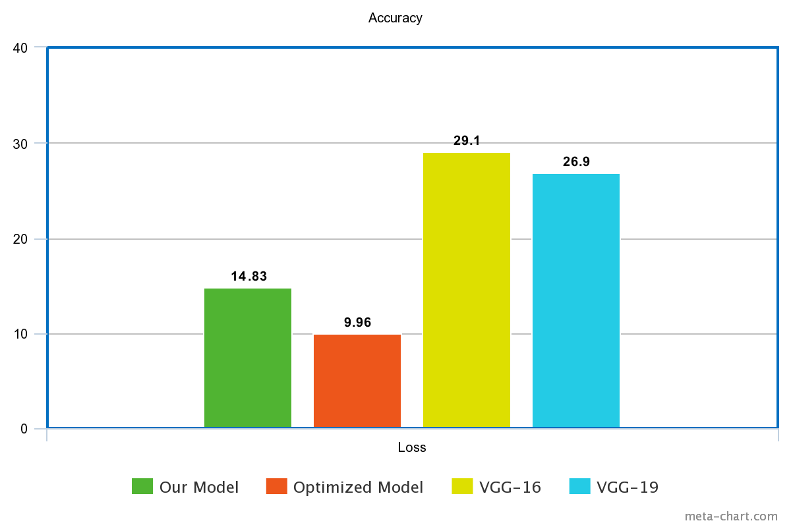
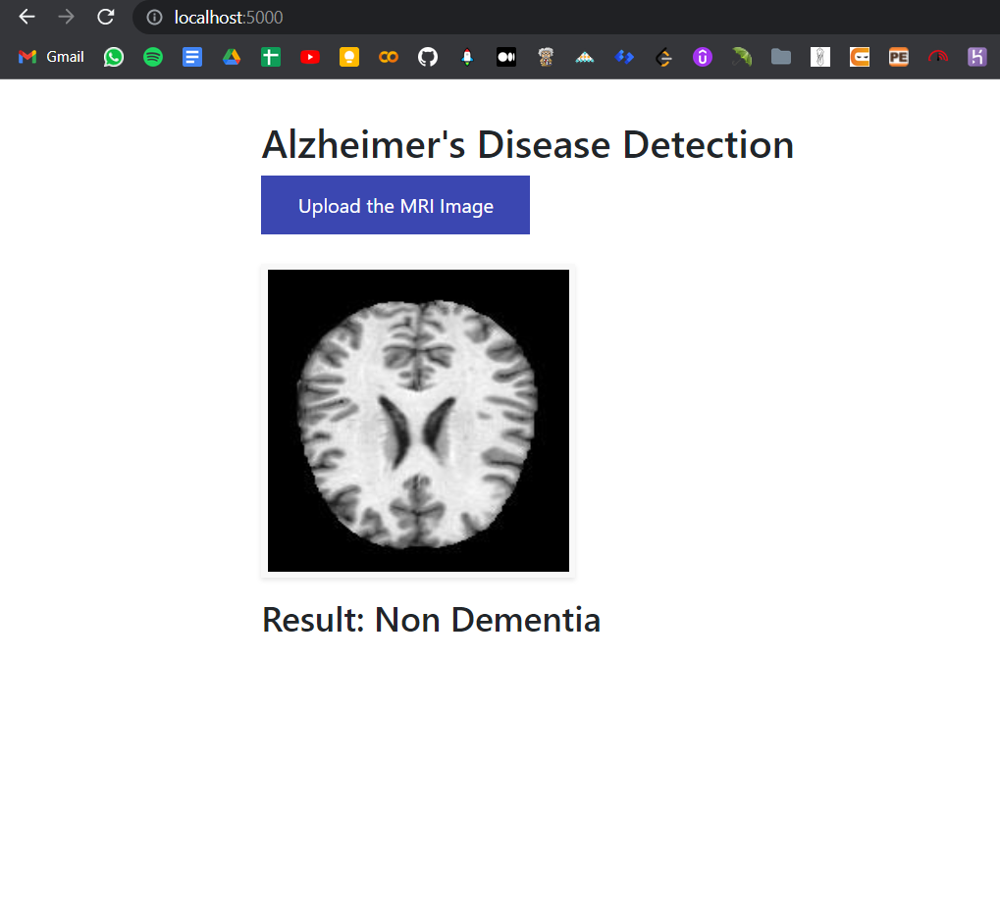

# Detection and Classification of Alzheimer's Disease Using CNN

### Alzheimer’s disease is a degenerative condition in which dementia symptoms grow over time. Memory loss is minimal in the early stages of Alzheimer’s, but people with late-stage Alzheimer’s lose their capacity to converse and respond to their surroundings.

### There are mainly 4 labels that need to be predicted:
1. Mild Dementia
2. Moderate Dementia
3. Non Dementia
4. Very Mild Dementia

### Technologies Used:
1. Flask for web application
2. CNN 

In this project, in order to detect and classify Alzheimer’s Disease we are using our own CNN model and comparing it with other pre-trained models such as VGG-16 and VGG-19 and comparing their efficiency to classify Alzheimer's Disease(AD).
The overall classification accuracy resulted from our model is 96.58%, which was more than the VGG-16 and VGG-19 models which were 92.38% and 92.09% respectively. Also we optimized our CNN model and got the accuracy 97.55%.

## Validation Accuracy Comparison in Percentage:

## Validation Loss Comparison in Percentage:

## Web Application:

